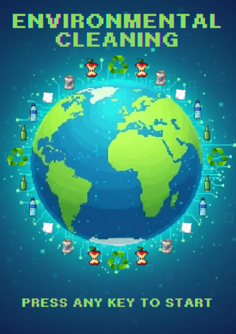
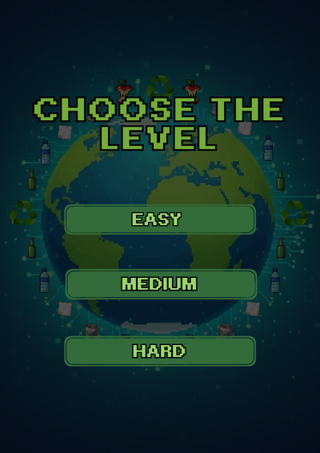
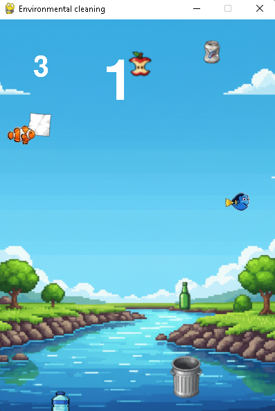

# ♻️ Environmental Cleaning

**Environmental Cleaning** é um jogo arcade educativo desenvolvido em Python com a biblioteca Pygame. O objetivo é conscientizar sobre a coleta seletiva de forma divertida: você controla uma lixeira e deve coletar os materiais recicláveis corretos enquanto desvia de obstáculos e cumpre metas de pontuação progressivas.

---

## 📸 Screenshots

| Menu Inicial | Level | Gameplay |
|:---:|:---:|:---:|
|  |  |  

---

## ⚙️ Funcionalidades do Jogo

- **Sistema de Níveis**: Três dificuldades distintas (Easy, Medium, Hard) que alteram a velocidade e os desafios.
- **Mecânica de Coleta**: Pegue Vidro, Papel, Metal, Maçã e Garrafas para pontuar.
- **Obstáculos Dinâmicos**: Evite os peixes que aparecem nos níveis mais difíceis!
- **Controle via Mouse**: Jogabilidade fluida onde a lixeira segue o cursor.
- **Feedback Sonoro**: Efeitos de áudio para coleta de itens e danos.

---

## 🏆 Níveis de Dificuldade

O jogo possui um sistema de progressão dividido em três estágios:

| Nível | Meta (Pts) | Velocidade | Obstáculos (Peixes) | Detalhes |
| :--- | :---: | :---: | :---: | :--- |
| **🟢 Easy** | 20 | Baixa | Nenhum | Ideal para aprender a mecânica. |
| **🟡 Medium** | 40 | Média | 1 Tipo | Aparece um peixe para atrapalhar. |
| **🔴 Hard** | 60 | Alta | 2 Tipos | Dois peixes e maior velocidade |

---

## 🕹️ Como Jogar

### Controles
- **Mouse**: Mova o cursor para controlar a lixeira para esquerda ou direita.
- **Teclado**: Pressione qualquer tecla para avançar nas telas de Menu, Vitória ou Game Over.

### Regras
1. **Ganhe Pontos**: Colete os lixos caindo (Papel, Metal, Vidro, etc).
2. **Evite Danos**: Não toque nos peixes (nos níveis Medium/Hard).
3. **Não deixe cair**: Se um lixo tocar ao rio sem ser coletado, você perde uma vida.
4. **Vitória**: Alcance a pontuação meta do nível escolhido.

---

## 📁 Estrutura de Pastas

```
Race for Approval/
│
├── assets/
│   └── png/
│     ├── background.png
│     ├── garrafa.png
│     ├── lixeira.png
│     ├── peixe1.png
│     ├── peixe2.png
│     ├── maca.png
│     ├── level.png
│     ├── metal.png
│     ├── vidro.png
│     ├── papel.png
│     ├── menu.png
│     ├── gameover.png
│     └── win.png
│   └── Sons/
│     ├── musica.mp3
│     ├── pontos.mp3
│     └── dano.mp3
│
├── game.py
├── main.py
├── menu.py
├── obj.py
└── README.md
```
## Bibliotecas usadas:
- pygame
- random
---

## 🚀 Como Jogar

1. **Requisitos**:
   - Python 3.10+
   - Biblioteca [pygame](https://www.pygame.org/)

2. **Instalação das dependências**:
   ```bash
   pip install pygame
   ```

3. **Executar o jogo**:
   ```bash
   python main.py
   ```
---

## 📌 Funcionalidades Implementadas

- Sistema de cenas (início, níveis, jogo, vitória e game over)
- Colisões com feedback sonoro
- Música de fundo contínua
- Interface de texto pixelado com pontuação e vidas atualizadas em tempo real
- Nível de dificuldade

---

## 👨‍💻 Desenvolvedores

- **Alunos**: Guilherme Teixeira e Artur Rio
- **Projeto Acadêmico** para disciplina de Príncipios de Programação da UFRPE
